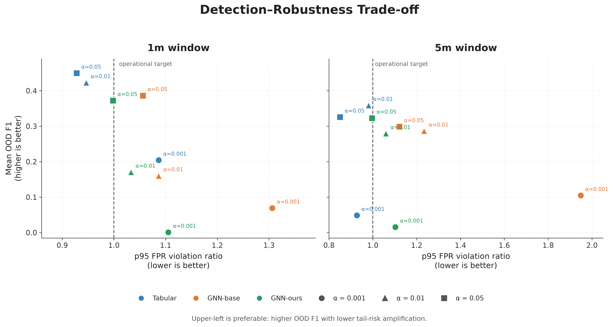
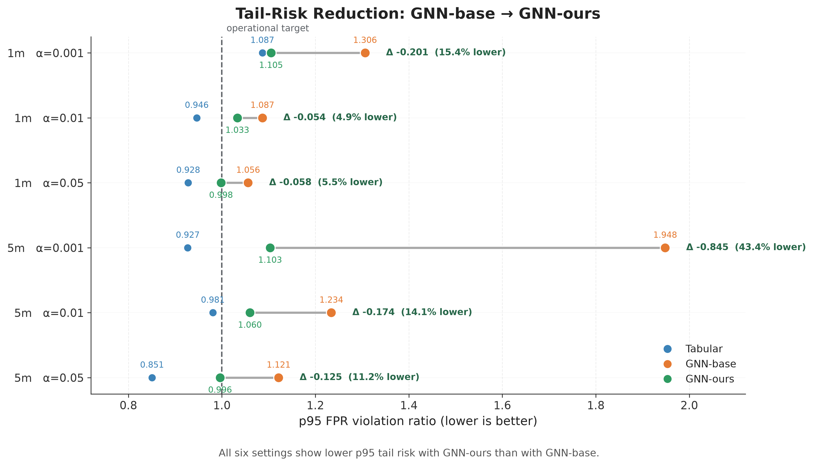

# Operationally Constrained Zero-Day IDS — Clean Reimplementation

A clean reimplementation of the core methodology from:

> **Operationally Constrained Zero-Day Intrusion Detection with Target-FPR Calibration and Similarity Graph Construction**<br>
> Yuseong Ha and Keecheon Kim<br>
> *Applied Sciences*, 2026, 16, 2284<br>
> https://doi.org/10.3390/app16052284

This repository reconstructs the main experimental pipeline of the published work, including target-FPR calibration, host-session graph construction, KNN similarity graphs, feature pre-smoothing, tabular baselines, and multiple GNN backbones.

## Important Reimplementation Notice

The original experimental source code used for the publication is no longer available.

Therefore, this repository is **not an exact reproduction of the published implementation**. It is a clean reimplementation based on the published paper, thesis materials, and recoverable experimental specifications.

Where implementation details could not be recovered exactly, explicit and reproducible design choices were made rather than attempting to force the reconstructed results to match the paper.

In particular:

- The published node representation used **142 features**, while this reimplementation uses **162 directional features**.
- The reconstructed host-session node counts differ from the published dataset.
- The reconstructed graph edge counts differ from the published graphs.
- This implementation uses a **split-aware graph policy** to prevent cross-split feature mixing and message passing.
- Numerical results in this repository should therefore be interpreted as **reimplementation results**, not as exact reproductions of the published tables.

---

## Research Goal

The project studies zero-day intrusion detection under operational false-alarm constraints.

Instead of selecting a detection threshold directly on the test distribution, the threshold is calibrated only on benign validation samples for a target false positive rate:

`alpha ∈ {0.001, 0.01, 0.05}`

The calibrated threshold is then transferred unchanged to held-out test data.

The implementation compares three model families:

- **Tabular** — Logistic Regression, Random Forest, MLP
- **GNN-base** — GCN, GIN, GraphSAGE, GAT using observed communication edges
- **GNN-ours** — the same GNN backbones using a cosine-similarity KNN graph and feature pre-smoothing

The primary operational quantity is the false-positive-rate violation ratio:

`violation_ratio = test_FPR / target_FPR`

A value near 1 means that the calibrated operating point transfers well to held-out benign traffic.

---

## Dataset

The reconstruction uses the improved CICIDS2017 dataset distributed as weekday CSV files.

Each network flow contains source/destination endpoints, timestamps, labels, and numeric traffic statistics.

Flows are aggregated into **host-session nodes** using:

- 1-minute windows
- 5-minute windows

Each host contributes two directional feature blocks:

- 81 outgoing-flow mean features
- 81 incoming-flow mean features

This produces a **162-dimensional node representation**.

If one direction has no flows within a host-session window, the corresponding directional block is filled with zero.

### Reconstructed Dataset Scale

| Window | Reimplementation Nodes | Feature Dim | Published Nodes | Published Feature Dim |
|---|---:|---:|---:|---:|
| 1m | 272,261 | 162 | 280,535 | 142 |
| 5m | 179,103 | 162 | 182,834 | 142 |

The difference is intentional and documented. The exact original 142-dimensional aggregation procedure could not be recovered reliably.

Raw and processed datasets are excluded from Git.

---

## Label Policy

Host-session labels are grouped into three categories:

| Category | Meaning |
|---|---|
| `BENIGN` | Normal traffic |
| `SEEN` | Attack classes available during training |
| `OOD` | Held-out zero-day attack family |

For the reconstructed main experiment, Botnet traffic is treated as the OOD attack family.

When multiple flow labels occur inside one host-session, the priority is:

`OOD > SEEN > BENIGN`

OOD nodes are excluded from both training and validation.

---

## Train / Validation / Test Policy

The reconstructed split uses:

- 60% train
- 20% validation
- 20% test
- stratification over BENIGN and SEEN samples
- all OOD samples forced into the test split

Current reconstructed sizes are:

| Window | Train | Validation | Test |
|---|---:|---:|---:|
| 1m | 162,286 | 54,095 | 55,880 |
| 5m | 107,166 | 35,722 | 36,215 |

Feature standardization is fitted on the **training split only** and then applied unchanged to validation and test data.

---

## Leakage-Sensitive Graph Policy

A deliberate difference from the original publication is the graph isolation policy used here.

This reimplementation does **not** allow graph message passing or pre-smoothing across train, validation, and test boundaries.

For every split:

1. Communication edges are restricted to nodes belonging to that split.
2. KNN similarity graphs are independently reconstructed inside that split.
3. Feature pre-smoothing is performed only with neighbors from the same split.
4. GNN message passing is performed only inside that split graph.

This policy avoids cross-split feature propagation and makes the reconstructed implementation explicitly leakage-sensitive.

It should not be interpreted as a claim that the original publication used the same graph isolation policy.

---

## Graph Construction

### GNN-base

The base graph uses observed host-to-host communication relationships reconstructed from the underlying flow records.

Edge weight:

`interaction_count`

### GNN-ours

The proposed graph uses exact cosine KNN search on standardized host-session features.

Main configuration:

`k = 3`

Each stored edge represents an undirected node pair.

Edge weight:

`cosine_similarity`

KNN construction is GPU-accelerated when CUDA is available.

---

## Feature Pre-Smoothing

For GNN-ours, node features are pre-smoothed using the weighted KNN graph:

`X' = (1 - gamma) X + gamma D^-1 A X`

Main configuration:

`gamma = 0.3`

For GNN-base:

`gamma = 0`

The smoothing implementation supports arbitrary global node IDs while internally mapping them to split-local tensor positions.

---

## Models

### Tabular

- Logistic Regression
- Random Forest
- MLP

### GNN

The same four backbones are evaluated for both GNN-base and GNN-ours:

- GCN
- GIN
- GraphSAGE
- GAT

Main GNN configuration:

| Parameter | Value |
|---|---:|
| Epochs | 80 |
| Hidden dimension | 128 |
| GNN layers | 2 |
| Dropout | 0.2 |
| Learning rate | 1e-3 |
| GAT heads | 4 |
| Seeds | 0, 1, 2, 3, 4 |

Some optimizer, class-balancing, and implementation-level choices could not be recovered from the original code and are therefore documented clean-reimplementation choices.

---

## Target-FPR Calibration

Threshold calibration uses **only benign validation scores**.

For each target FPR `alpha`, the implementation selects a conservative threshold satisfying:

`validation_FPR <= alpha`

Ties are handled conservatively so that the realized validation FPR does not exceed the requested operating point.

The threshold is then applied unchanged to the test split.

Target operating points:

`{0.001, 0.01, 0.05}`

---

## Operational Metrics

The experiment records:

- Seen precision / recall / F1
- OOD precision / recall / F1
- test FPR
- target-FPR violation ratio
- p90 / p95 violation-ratio tail risk
- StrictOK
- BudgetOK at B = 3, 5, and 10

`StrictOK` corresponds to:

`violation_ratio <= 1`

The family-level p90/p95 values follow the paper-style aggregation procedure: percentile statistics are first computed across seeds for each model/backbone, followed by averaging across models inside a family.

---

## Reimplementation Results

The full experiment contains:

- 2 temporal windows
- 3 model families
- 3 target FPR operating points
- 5 random seeds
- 3 tabular models
- 4 GNN backbones

The GNN experiment contains **240 evaluated rows**, while the tabular experiment contains **90 evaluated rows**.

### Key Visual Results

#### Detection–Robustness Trade-off



The reconstructed experiments show a clear trade-off between zero-day detection quality and operational stability. Tabular baselines remain highly competitive in OOD F1, while GNN-ours consistently reduces p95 tail-risk relative to GNN-base across all six evaluated settings.

#### Tail-Risk Reduction



Across all six combinations of temporal window and target FPR, GNN-ours reduces the p95 FPR violation ratio relative to GNN-base. However, the OOD F1 improvements reported in the original publication are not consistently reproduced in this clean reimplementation.


### Family-Level Comparison

| Window | alpha | Tabular OOD F1 | GNN-base OOD F1 | GNN-ours OOD F1 | Tabular p95 | Base p95 | Ours p95 |
|---|---:|---:|---:|---:|---:|---:|---:|
| 1m | 0.001 | 0.2044 | 0.0693 | 0.0009 | 1.0866 | 1.3063 | 1.1051 |
| 1m | 0.010 | 0.4227 | 0.1601 | 0.1705 | 0.9463 | 1.0867 | 1.0331 |
| 1m | 0.050 | 0.4494 | 0.3863 | 0.3723 | 0.9280 | 1.0562 | 0.9982 |
| 5m | 0.001 | 0.0486 | 0.1048 | 0.0157 | 0.9270 | 1.9484 | 1.1032 |
| 5m | 0.010 | 0.3586 | 0.2864 | 0.2795 | 0.9807 | 1.2342 | 1.0600 |
| 5m | 0.050 | 0.3256 | 0.2986 | 0.3227 | 0.8505 | 1.1214 | 0.9961 |

These results do **not** reproduce the numerical values reported in the paper.

Instead, they show the behavior of the reconstructed methodology under the leakage-sensitive implementation policy used in this repository.

### Main Observation

The tabular models are highly competitive in detection quality in this reconstruction.

GNN-ours does not consistently outperform either GNN-base or the tabular family in OOD F1.

However, compared with GNN-base, GNN-ours reduces the **p95 violation ratio in all six window / target-FPR combinations**.

For example:

`5m, alpha=0.001: 1.9484 -> 1.1032`

This suggests a trade-off in the reconstructed experiment:

> similarity-based graph construction and pre-smoothing improve operational false-alarm stability, but do not guarantee higher zero-day detection F1, particularly under very strict operating points.

This observation is specific to the reconstructed pipeline and should not be interpreted as a replacement for the conclusions of the published study.

---

## Important Evaluation Limitation

In the current reconstruction, Seen and OOD evaluations use the same held-out benign test pool.

Therefore, for a fixed model and threshold, their realized benign FPR is identical.

As a result, the violation ratio in this repository should be interpreted as:

> transfer of a validation-calibrated operating point to held-out benign test traffic

rather than as a measurement based on a separately shifted OOD benign distribution.

This distinction is important when comparing the reconstructed operational metrics with the original publication.

---

## Repository Structure

```text
.
├── README.md
├── requirements.txt
├── figures/
│   ├── detection_robustness_tradeoff.png
│   ├── detection_robustness_tradeoff.pdf
│   ├── tail_risk_reduction.png
│   └── tail_risk_reduction.pdf
├── results/
│   ├── family_comparison.csv
│   ├── family_comparison_wide.csv
│   ├── gnn_backbone_summary.csv
│   ├── gnn_base_vs_ours.csv
│   ├── gnn_family_summary.csv
│   ├── gnn_results.csv
│   ├── tabular_family_summary.csv
│   ├── tabular_model_summary.csv
│   └── tabular_results.csv
└── src/
    ├── preprocess.py
    ├── split.py
    ├── normalize.py
    ├── knn_graph.py
    ├── graph_split.py
    ├── smoothing.py
    ├── calibration.py
    ├── evaluation.py
    ├── tabular.py
    ├── mlp.py
    ├── gnn.py
    ├── run_tabular_experiment.py
    ├── run_tabular_batch.py
    ├── summarize_tabular_results.py
    ├── run_gnn_experiment.py
    ├── run_gnn_batch.py
    ├── summarize_gnn_results.py
    ├── build_family_comparison.py
    └── plot_results.py
```

## Environment

Tested with:

- Python 3.11
- NumPy 2.4.6
- pandas 3.0.5
- scikit-learn 1.9.1
- PyTorch 2.11.0 with CUDA 12.8
- PyTorch Geometric 2.8.0

Experiments were executed on an NVIDIA RTX 3070 GPU.

## Running the Experiments

Processed datasets are intentionally excluded from Git.

GNN experiments:

```powershell
python -m src.run_gnn_batch `
  --windows 1m 5m `
  --methods base ours `
  --backbones gcn gin sage gat `
  --seeds 0 1 2 3 4 `
  --epochs 80 `
  --device cuda `
  --output results/gnn_results.csv
```

Tabular experiments:

```powershell
python -m src.run_tabular_batch `
  --windows 1m 5m `
  --models lr rf mlp `
  --seeds 0 1 2 3 4 `
  --epochs 80 `
  --device cuda `
  --output results/tabular_results.csv
```

The batch runners support resuming completed settings.

## Citation

If you use or reference the methodology, please cite the original paper:

> Y. Ha and K. Kim,<br>
> "Operationally Constrained Zero-Day Intrusion Detection with Target-FPR Calibration and Similarity Graph Construction,"<br>
> *Applied Sciences*, vol. 16, 2026, Art. no. 2284.<br>
> https://doi.org/10.3390/app16052284